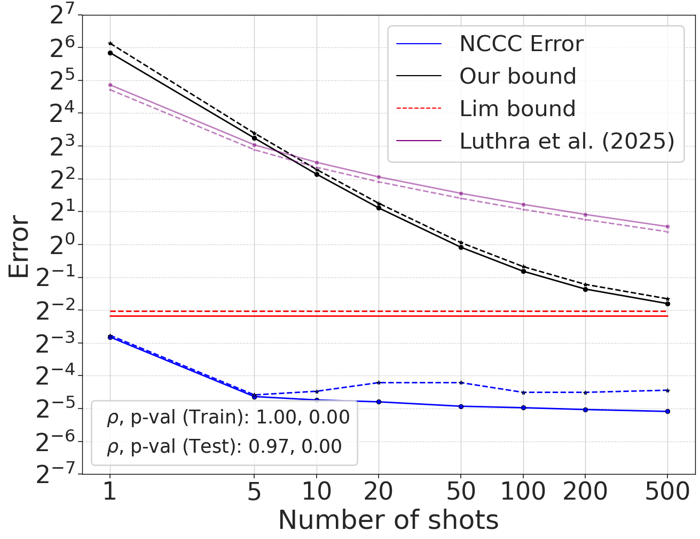
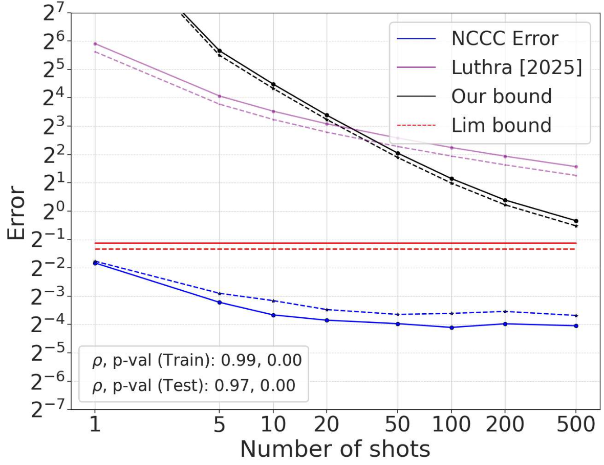

# Directional Neural Collapse in Self-Supervised Visual Representation Learning
[Project Page](https://dlfundamentals.github.io/directional-neural-collapse/) | [Paper](https://arxiv.org/pdf/2603.03530)

Authors: Achleshwar Luthra*, Yash Salunkhe*, and Tomer Galanti*. (* denotes equal contribution)

We acknowledge the public availability of the following repositories, which we have built upon in our work:

- [Lightly-SSL](https://github.com/lightly-ai/lightly) for training models from scratch
- [Hugging Face Hub](https://huggingface.co/) for providing pretrained models; and the contributors of the models we used: 
    - [VICReg](https://huggingface.co/Ramos-Ramos/vicreg-resnet-50)
    - [MAE](https://huggingface.co/facebook/vit-mae-base)
    - [IJEPA](https://huggingface.co/facebook/ijepa_vith16_1k)
    - [DINOv2](https://huggingface.co/facebook/dinov2-base)
    - [CLIP](https://huggingface.co/openai/clip-vit-base-patch32)
    - [SigLIP](https://huggingface.co/google/siglip-base-patch16-224)
- [Timm](https://github.com/rwightman/pytorch-image-models) for vision models and datasets

## Abstract
Frozen self-supervised representations often transfer well with only a few labels across many semantic tasks. We argue that a single geometric quantity, *directional* CDNV (decision-axis variance), sits at the core of two favorable behaviors: strong few-shot transfer within a task, and low interference across many tasks. We show that both emerge when variability *along* class-separating directions is small. 

- First, we prove sharp non-asymptotic multiclass generalization bounds for downstream classification whose leading term is the directional CDNV. The bounds include finite-shot corrections that cleanly separate intrinsic decision-axis variability from centroid-estimation error. 
- Second, we link decision-axis collapse to multitask geometry: for independent balanced labelings, small directional CDNV across tasks forces the corresponding decision axes to be nearly orthogonal, helping a single representation support many tasks with minimal interference. 

Empirically, across SSL objectives, directional CDNV collapses during pretraining even when classical CDNV remains large, and our bounds closely track few-shot error at practical shot sizes. Additionally, on synthetic multitask data, we verify that SSL learns representations whose induced decision axes are nearly orthogonal.


# Theorem 4.1. Multiclass generalization bound

In our [previous work](https://openreview.net/forum?id=mf4V1SK0np), we showed that for any $a \geq 5$,

$$ \text{err}^{\texttt{NCC}}_{m, C}(f) \leq (C'-1)\Bigg[
\Big(\tfrac12-\tfrac{2}{a}-\tfrac{2^{3/2}}{am}\Big)^{-2}\tilde V_f +\tfrac{a}{4}\Big(\tfrac{2}{\sqrt m}(V_f^{s}+V_f)+\tfrac{1}{m}V_f\Big)
\Bigg] $$

To verify the above bound for different values of $m$ and $C$, we provide the following evaluation scripts: [nccc_eval.py](src/nccc_eval.py), [cdnv_eval.py](src/cdnv_eval.py), and [old_bound_core.py](bound_analysis/old_bound_core.py). Please follow the instructions below to evaluate the metrics required to verify the theorem.

> Old bound is computed in the [error_bounds.ipynb](notebooks/error_bounds.ipynb) notebook using the [old_bound_core.py](bound_analysis/old_bound_core.py) script.

#### Our Contribution (New Bound) - 
Let $C' \geq 2$ and $m \geq 10$ be integers. Fix a feature map $f : \mathcal{X} \to \mathbb{R}^d$ and class-conditional distributions $D_1, \ldots, D_{C'}$ over $\mathcal{X}$. Then the average multiclass error of the NCC classifier satisfies

$$\text{err}_{m,c}^{\text{NCC}}(f) \leq \frac{1}{C'} \sum_{i=1}^{C'} \sum_{j \neq i} \frac{4\,\tilde{V}_{ij}}{\left(1 + \frac{v_j - v_i}{m\,d_{ij}^2}\right)^2} + \frac{1}{C'} \sum_{i=1}^{C'} \sum_{j \neq i} \frac{\left(\sqrt{E^1_{ij}} + \sqrt{E^2_{ij}} + \sqrt{E^3_{ij}}\right)^2}{\left(1 + \frac{v_j - v_i}{m\,d_{ij}^2}\right)^2}$$

### NCCC evaluation

```python
python src/nccc_eval.py \
--config <path-to-config-yaml> \
--ckpt_path <checkpoints_dir or checkpoints_file> \
--output_path <output-dir> \
--repeat <num-repeats>
```

This shall result in `nccc.csv` file in your output directory. 

### CDNV evaluation

```python
python src/cdnv_eval.py \
--config <path-to-config-yaml> \
--ckpt_path <checkpoints_dir or checkpoints_file> \
--output_path <output-dir>
```

This shall result in `cdnv.csv` file in your output directory.

## New generalization bound evaluation

While our previous bound correctly targets the decision-axis variance, it can be loose at practical values of $m$. To get meaningful guarantees when representations are anisotropic, we study the pairwise margin between classes. Our bound (i) cleanly separates the decision direction, (ii) accounts for finite-sample effects, and (iii) remains valid even when the feature distribution has heavy tails.


### Computing pairwise geometric metrics for new error bound

The new bound depends on pairwise geometric statistics between classes, such as:
- squared distance between class means,
- normalized within-class variance,
- variance along the decision direction,
- and a fourth-moment (tail) correction.

These metrics are computed using the `GeometricEvaluator` class in [src/bound_eval.py](src/bound_eval.py). To compute these metrics, run the following command:

```python
python src/bound_eval.py \
--config <path-to-config-yaml> \
--ckpt_path <checkpoints_dir or checkpoints_file> \
--output_path <output-dir>
```

This will produce `train_pairwise_metrics.json` and `test_pairwise_metrics.json` files in your output directory.


### Computing the final error bounds

Once the above metrics are available, you can compute the final error bounds by following the instructions in the [error_bounds.ipynb](notebooks/error_bounds.ipynb) notebook. We have shown an example of the final error bound visualization for the MAE and DINOv2 model below:

<p align="center">
  
  
</p>

<p align="center">
  <em>
    Left: Generalization bound for MAE.
    Right: Generalization bound for DINO.
  </em>
</p>

This function implements the new error bound from Thm. 4.1 by:
- combining decision-axis variance, finite-sample noise, and higher-order terms,
- and averaging across the selected classes.

```
compute_new_error_bound(pairwise_metrics, m, sel_classes)
```

This function implements the old error bound from our previous work.

```
compute_old_error_bound(alpha: float, beta: float, m: int)
"""
Args:
        alpha (float): Directional CDNV
        beta (float): CDNV
        m (int): Number of shots per class
"""
```

# Training SSL models from scratch

Our repository supports training following SSL methods from scratch using [Lightly-SSL](https://github.com/lightly-ai/lightly-ssl):
- VICReg
- SimCLR
- MAE
- DINOv2

You can find the training scripts and necessary utilities in the [training_scratch](src/training_scratch) folder. Please refer to the [training_from_scratch.md](docs/training_from_scratch.md) document for detailed instructions on training these models from scratch.

# Multiaxis Orthogonality 

We show that as SSL training progresses, decision axes corresponding to different independent semantic labelings (e.g., color, shape, size, style of an object) become nearly orthogonal in feature space. \
**Proposition 4.2** (Near-orthogonality from small directional CDNV). Assume $y^{(1)}, y^{(2)} \in \lbrace \pm 1 \rbrace$ are balanced and independent, and $d_1, d_2 > 0$. Then

$$|u_1^\top u_2| \leq \min\left(\frac{2d_1}{d_2}\sqrt{\tilde{V}^{(1)}},\ \frac{2d_2}{d_1}\sqrt{\tilde{V}^{(2)}}\right)$$

where $u_\ell$ is the unit decision axis for task $\ell$, $d_\ell$ is the mean gap between classes, and $\tilde{V}^{(\ell)}$ is the directional CDNV for task $\ell$. Intuitively, when within-class variance is small along each task's decision axis (i.e., $\tilde{V}^{(1)}, \tilde{V}^{(2)} \ll 1$) and the mean gaps are comparable ($d_1 \asymp d_2$), the bound forces $|u_1^\top u_2| \ll 1$, meaning the two decision axes are nearly orthogonal.

## Citation
If you find our work useful in your research, please consider citing the following paper:

```bibtex
TODO
```
