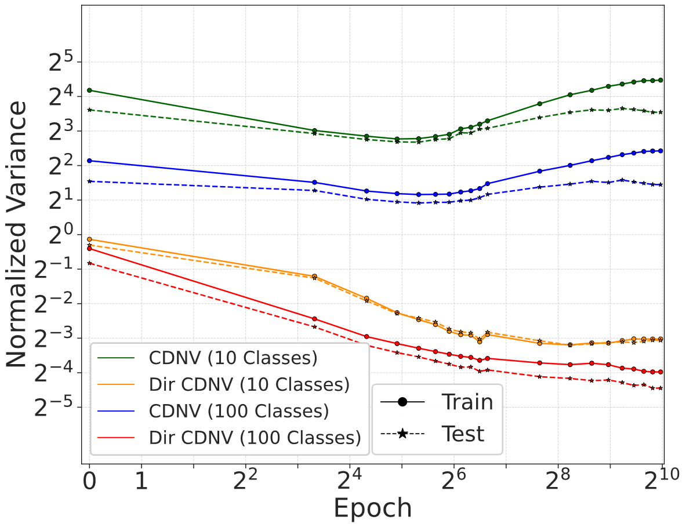

## Hierarchical Clustering Experiment


```python
python src/granular_cdnv.py \
--config <path-to-config-yaml> \
--ckpt_dir <checkpoints_dir or checkpoints_file> \
--output_path <output-dir> \
--label_level super \
--superclass_mapping_json <path-to-mapping-json-file>
```

This shall results in `cdnv.csv` file in your output directory with respect to the 10 superclasses. 


To plot the dynamics of training for both fine-grained and clustered classes, please refer to [plot_hierarchial_clustering.ipynb](../notebooks/plot_hierarchial_clustering.ipynb).

<figure>
	
	<figcaption>
		<strong>Figure:</strong> Illustration of the hierarchial clustering experiment for VicReg. Each fine-grained class is mapped to one of 10 superclasses, and CDNV dynamics are tracked at both label granularities during training.
	</figcaption>
</figure>